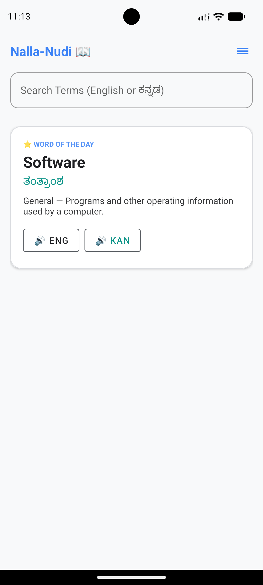
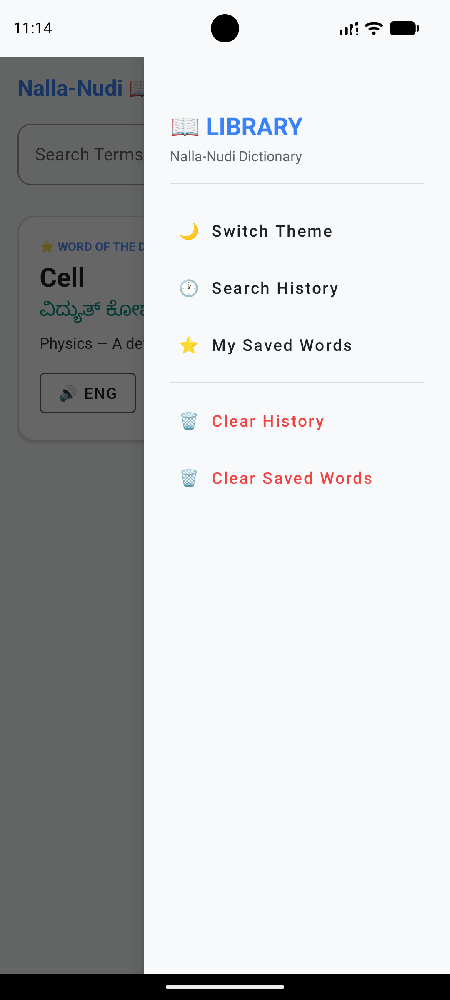
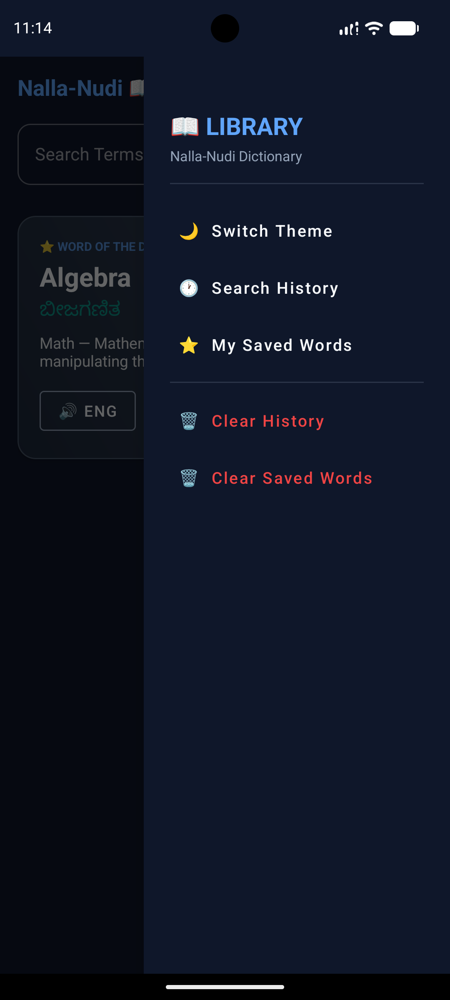
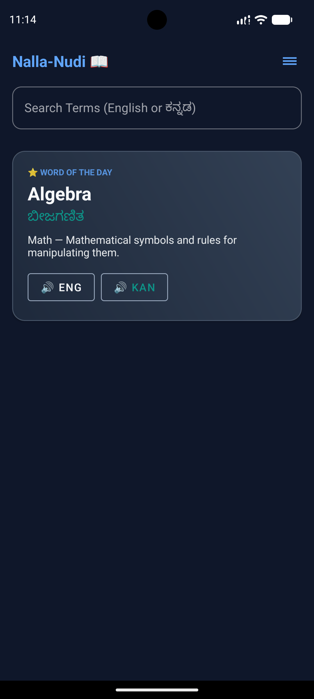
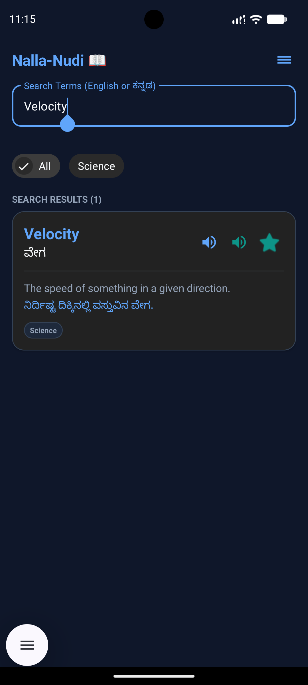
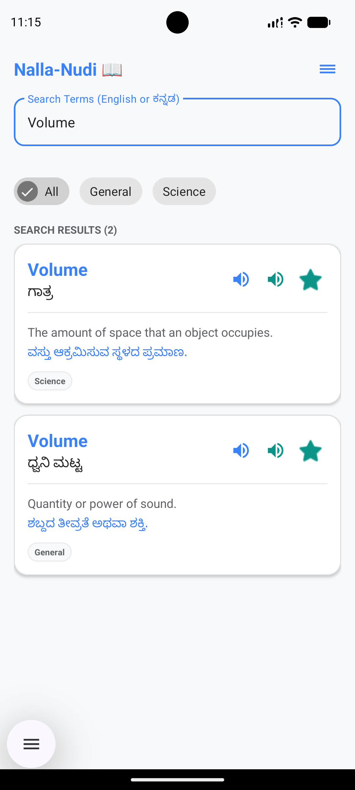

# Nalla-Nudi: Technical Dictionary for Students

**Nalla-Nudi** (ನಲ್ಲ ನುಡಿ) is a premium, Material Design 3-based Android application designed to bridge the language gap for students transitioning from Kannada-medium to English-medium education.

[](https://thrinadh2164.github.io/Nalla_Nudi/)
[](https://github.com/thrinadh2164/Nalla_Nudi/releases/latest)

---

## 🌟 Key Features

- **🚀 Instant Offline Search**: Lighting fast search across 50+ pre-seeded technical terms without needing internet.
- **✨ AI-Powered Translation**: If a word isn't in our offline library, our "AI Translator" provides an intelligent generated translation and explanation.
- **🎙️ Voice Guide (TTS)**: Native English pronunciation for every word, including AI-generated results, to help with phonetics.
- **🌗 Dynamic Theming**: Full support for high-contrast Light and sleek Dark modes based on Material 3 guidelines.
- **📚 Subject-Wise Filtering**: Quickly filter terms by Physics, Biology, Math, Science, and Commerce.
- **⭐ My List & History**: Save difficult terms to your personal favorites and track your search history.
- **🎲 Word of the Day**: Get a randomly featured technical term every time you open the app to expand your vocabulary.

## 📸 Screenshots

<p align="center">
  
  
  
</p>
<p align="center">
  
  
  
</p>

## 🛠️ Technology Stack

- **Language**: 100% Kotlin
- **Architecture**: MVVM with Room Persistence
- **Database**: Room Database (SQLite) with JSON-based initial seeding
- **UI Framework**: Material Design 3 (M3)
- **Concurrency**: Kotlin Coroutines & Flow
- **Assets**: Custom SVG vectors and HSL-tailored color palettes

## 🏗️ Project Structure

```
Nalla-Nudi/
├── app/                        # Android Source Code
├── docs/                       # Project Website & Documentation (HTML)
├── .gitignore                  # Git Ignore Rules
├── LICENSE                     # MIT License
└── README.md                   # Project Overview
```

## 🚀 Getting Started

1. **Clone the Repo**
   ```bash
   git clone https://github.com/thrinadh2164/Nalla_Nudi.git
   ```
2. **Open in Android Studio**
   - Import the project and let Gradle sync.
   - The app targets **Android 14 (API 34)**.
3. **Run**
   - Connect your device or start an emulator.
   - Press `Shift + F10`.

## 📝 License
Copyright © 2024 Nalla-Nudi Team. All rights reserved.

---
**Built with ❤️ for educational accessibility.**

**Author: E Thrinadh Chowdary**
